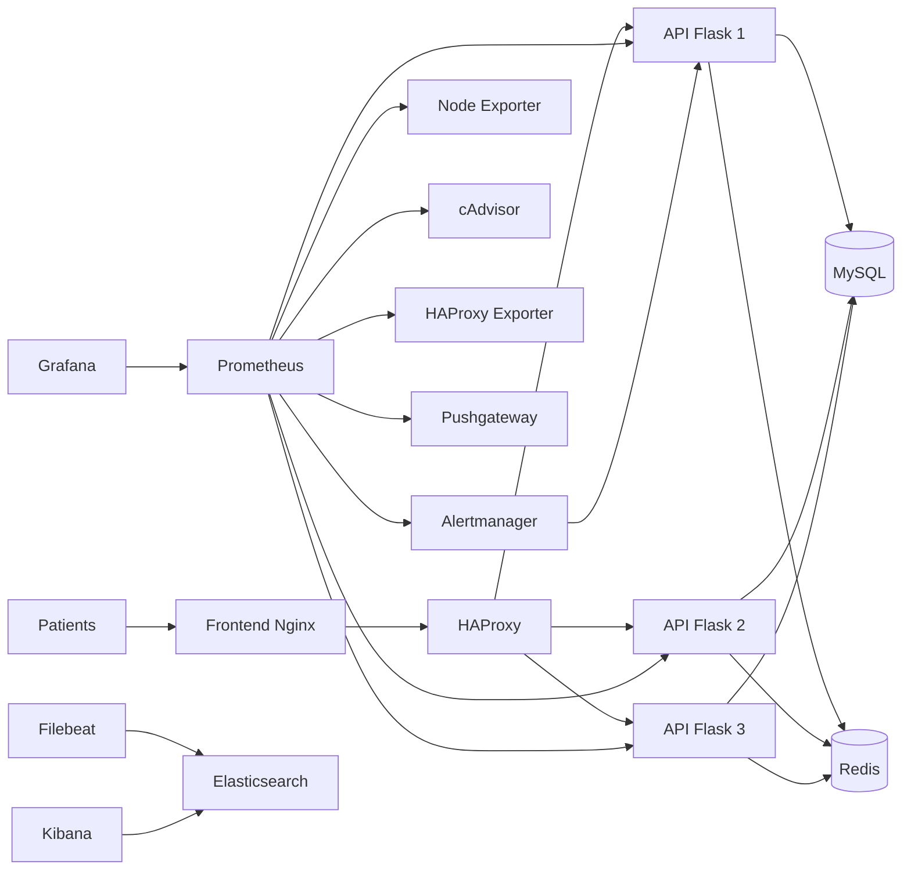

# Rapport Final - Mise en place du monitoring MedAssist

## 0. Contexte et objectif

MedAssist est une plateforme de teleconsultation avec une forte croissance utilisateur.  
L'objectif de ce TP etait de mettre en place une supervision complete afin de:
- detecter les incidents avant les utilisateurs,
- suivre la performance applicative,
- monitorer la conformite des sauvegardes,
- organiser une reponse a incident claire (alerting + runbooks),
- valider un scenario de haute disponibilite et de reprise.

Le travail a ete realise sur une stack Docker composee de:
- Frontend Nginx
- API Flask
- MySQL
- Redis
- Prometheus, Grafana, cAdvisor, Node Exporter
- Elasticsearch, Kibana, Filebeat
- HAProxy + HAProxy Exporter
- Alertmanager
- Pushgateway

---

## 1. Architecture finale de supervision

Points clefs d'architecture:
- separation logique applicative (`medassist`) et monitoring (`monitoring`),
- centralisation metriques (Prometheus) + logs (ELK),
- alerting unifie via Alertmanager,
- supervision HA via HAProxy exporter,
- supervision backup via Pushgateway.

---

## 2. Demarche de realisation (etapes executees)

## Partie 1 - Monitoring infrastructure et API (Prometheus/Grafana)

### Etapes realisees
1. Ajout des services de supervision dans `docker-compose.yml`:
   - `prometheus`, `grafana`, `cadvisor`, `node-exporter`.
2. Configuration des cibles Prometheus dans `prometheus/prometheus.yml`:
   - API (3 instances),
   - cAdvisor,
   - Node Exporter,
   - HAProxy exporter,
   - Pushgateway.
3. Verification de disponibilite:
   - `http://localhost:9090/targets`
   - `http://localhost:3000`
4. Import des dashboards Grafana:
   - `grafana/dashboard_use.json`
   - `grafana/dashboard_red.json`

### Dashboards produits
- USE (6 panneaux): CPU, memoire, reseau (utilisation/saturation/erreurs).
- RED (3 panneaux): rate, errors, duration.

### Resultat
- Supervision infra et API fonctionnelle.
- Metriques exploitables pour incidents et capacite.

---

## Partie 2 - Centralisation des logs (ELK)

### Etapes realisees
1. Ajout/verification des services:
   - `elasticsearch`, `kibana`, `filebeat`.
2. Correction technique importante:
   - sous Windows, `filebeat.yml` est vu comme trop permissif.
   - solution appliquee: lancement Filebeat avec `--strict.perms=false`.
3. Ajout de logs JSON structures dans l'API:
   - `method`, `endpoint`, `status`, `duration`, `remote_addr`.
4. Validation Elasticsearch:
   - creation du data stream Filebeat.
5. Creation du Data View Kibana:
   - pattern `filebeat-*`
   - champ temporel `@timestamp`.

### Dashboard Kibana (a presenter)
- erreurs 5xx dans le temps,
- endpoints les plus appeles,
- distribution des latences,
- erreurs par conteneur/service,
- vue temps reel des logs.

### Resultat
- Logs centralises et exploitables pour diagnostic.

---

## Partie 3 - Monitoring des sauvegardes MySQL

### Etapes realisees
1. Deploiement Pushgateway.
2. Script `backup/backup.sh` utilise pour:
   - lancer `mysqldump`,
   - mesurer statut, taille, duree, timestamp,
   - pousser metriques vers Pushgateway.
3. Configuration Prometheus:
   - job `pushgateway`,
   - `honor_labels: true`.
4. Dashboard Grafana backup:
   - statut,
   - taille,
   - duree,
   - age de derniere sauvegarde,
   - historique.
5. Alertes backup configurees:
   - backup en echec,
   - RPO depasse,
   - taille anormale,
   - metriques absentes.

### Resultat
- Suivi continu de la conformite RPO.
- Detection proactive des echecs backup.

---

## Partie 4 - Haute disponibilite et simulation PCA/PRA

### Etapes realisees
1. Mise en place de 3 instances API:
   - `api`, `api2`, `api3`.
2. Configuration HAProxy:
   - load-balancing round-robin,
   - health checks sur `/health`,
   - page stats `http://localhost:8404/stats`.
3. Correction incident HAProxy:
   - suppression d'une directive socket non compatible (permission denied),
   - redemarrage valide.
4. Ajout HAProxy exporter pour metriques Prometheus.
5. Dashboard Grafana HA:
   - backends actifs,
   - sante individuelle,
   - erreurs 5xx par instance,
   - debit de requetes.

### Scenarios de test
- Panne partielle:
  - arret d'une instance API,
  - verification continuiteservice via HAProxy.
- Panne totale:
  - arret API + MySQL + Redis,
  - observation cascade d'alertes,
  - restoration ordonnee.

### Mesures a renseigner
- MTTD panne partielle: `__A_COMPLETER__` minutes.
- Impact utilisateur panne partielle: `__A_COMPLETER__`.
- MTTR panne totale: `__A_COMPLETER__` minutes.

---

## Partie 5 - Strategie d'alerting et reponse aux incidents

### Strategie de priorite
- P1: critique (indisponibilite majeure / risque donnees)
- P2: degradation forte service
- P3: incident modere
- P4: signal faible / observabilite degradee

### Etapes realisees
1. Configuration Alertmanager:
   - routage par severite `p1/p2/p3/p4`,
   - receveurs distincts.
2. Webhook de reception d'alertes dans l'API:
   - route `/api/webhook/alert`.
3. Regles Prometheus:
   - total: 13 alertes (infra, API, HA, backup),
   - couverture complete P1->P4.
4. Runbooks rediges:
   - `runbooks/P1_AllApiDown.md`
   - `runbooks/P1_MysqlBackupFailed.md`
   - `runbooks/P2_ApiErrorRateHigh.md`

### Resultat
- Chaine complete: metric -> alert -> routage -> webhook -> procedure.

---

## 3. SLI / SLO retenus

## API
- SLI disponibilite: ratio requetes non-5xx / total.
- SLO disponibilite: >= 99.9% sur 30 jours.
- SLI latence: p95 `flask_http_request_duration_seconds`.
- SLO latence: p95 < 800 ms.
- SLI erreurs: ratio 5xx.
- SLO erreurs: < 5% sur 5 minutes.

## Base de donnees
- SLI disponibilite: service MySQL up + health checks applicatifs.
- SLO disponibilite: >= 99.95% sur 30 jours.

## Sauvegardes
- SLI succes: `mysql_backup_status`.
- SLI anciennete: `time() - mysql_backup_last_timestamp`.
- SLO RPO: derniere sauvegarde <= 30 minutes.
- SLO succes: >= 99% des executions.

---

## 4. Strategie de sauvegarde (RPO/RTO)

- Frequence cible: 30 minutes.
- Outil: `mysqldump` via `backup/backup.sh`.
- Metriques poussees:
  - `mysql_backup_status`
  - `mysql_backup_size_bytes`
  - `mysql_backup_duration_seconds`
  - `mysql_backup_last_timestamp`
- RPO cible: 30 minutes.
- RTO cible: 60 minutes.

Procedure de restauration (resume):
1. restaurer dump sur MySQL sain,
2. verifier tables critiques,
3. remonter API + HAProxy,
4. valider via dashboards RED/HA et health checks.

---

## 5. Timeline incident (modele a completer)

## Panne partielle (1 replica API)
- HH:MM: arret `api2`
- HH:MM: alerte `ApiInstanceDown` declenchee
- HH:MM: verification HAProxy (2/3 backends UP)
- HH:MM: service toujours disponible pour utilisateurs
- HH:MM: redemarrage `api2`
- HH:MM: retour a l'etat nominal

## Panne totale (API + MySQL + Redis)
- HH:MM: arret des services critiques
- HH:MM: alertes P1/P2 declenchees
- HH:MM: diagnostic infra
- HH:MM: redemarrage `mysql` + `redis`
- HH:MM: redemarrage `api`, `api2`, `api3`, `haproxy`
- HH:MM: verification fonctionnelle (`/health`, `/api/payment`)
- HH:MM: cloture incident

---

## 6. Difficultes rencontrees et corrections appliquees

1. HAProxy inaccessible sur `:8081`:
   - cause: directive socket non autorisee dans conteneur.
   - correction: suppression de la directive, recreation du service.
2. Filebeat ne demarrait pas:
   - cause: controle permissions strict sous Windows.
   - correction: `--strict.perms=false`.
3. Alertmanager webhook initialement non resolu:
   - correction: ajout route API `/api/webhook/alert`.
4. Coherence HA:
   - correction: ajout des services `api2` et `api3` + backend HAProxy coherent.

---

## 7. Recommandations d'amelioration

- Provisioning Grafana automatique (datasource + dashboards as code).
- Alertes SLO/Error Budget dediees.
- Tracing distribue (OpenTelemetry + Jaeger/Tempo).
- Sauvegarde chiffree hors site + test de restauration hebdomadaire.
- Regles d'inhibition et silences Alertmanager en maintenance.
- Pipeline CI pour valider la syntaxe compose/prometheus/alertmanager avant deploiement.

---

## 8. Captures d'ecran (preuves)

Les captures doivent etre deposees dans:
- `screenshots/partie1/`
- `screenshots/partie2/`
- `screenshots/partie3/`
- `screenshots/partie4/`
- `screenshots/partie5/`

Liste minimale conseillee:
1. Prometheus targets toutes UP.
2. Dashboard USE.
3. Dashboard RED.
4. Dashboard HA.
5. Dashboard backup.
6. Kibana dashboard logs.
7. Alertmanager avec alertes P1/P2/P3/P4.
8. Preuve webhook recu dans logs API.

