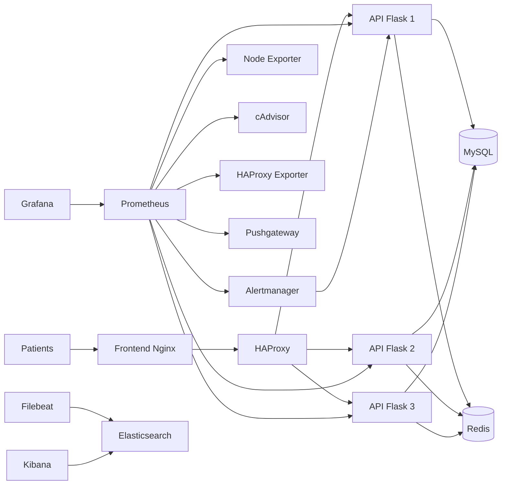

# Rapport Final - TP Monitoring MedAssist

## Etudiant
- Nom / Prenom: `A_COMPLETER`
- Formation / Promo: `A_COMPLETER`
- Date de rendu: `A_COMPLETER`

---

## 1. Contexte et objectifs

MedAssist est une application de teleconsultation qui a connu une forte croissance.  
Le besoin principal de ce TP est de mettre en place une observabilite complete pour:
- detecter rapidement les incidents,
- mesurer la performance de l'application,
- monitorer les sauvegardes MySQL et la conformite RPO,
- tester la haute disponibilite (HA) et des scenarios PCA/PRA,
- structurer l'alerting et la reponse aux incidents.

Objectif final: disposer d'une stack de monitoring exploitable en production avec preuves de tests.

---

## 2. Architecture cible

### Commentaires architecture
- Reseau `medassist`: services applicatifs.
- Reseau `monitoring`: observabilite.
- API en 3 instances derriere HAProxy pour la HA.
- Metriques centralisees dans Prometheus, visualisation dans Grafana.
- Logs centralises via Filebeat -> Elasticsearch -> Kibana.

[INSERER SCREEN: `screenshots/partie1/architecture_stack_overview.png`]

---

## 3. Partie 1 - Monitoring infrastructure et API

### 3.1 Services de monitoring deploies
- `prometheus`
- `grafana`
- `cadvisor`
- `node-exporter`

### 3.2 Configuration Prometheus
Scrape des cibles:
- API (`api`, `api2`, `api3`)
- cAdvisor
- Node Exporter
- HAProxy exporter
- Pushgateway

Validation:
- page Targets Prometheus
- verification que les cibles critiques sont `UP`

[INSERER SCREEN: `screenshots/partie1/prometheus_targets_up.png`]

### 3.3 Dashboard USE (infrastructure)
Dashboard `grafana/dashboard_use.json` avec panneaux:
- CPU utilisation
- CPU saturation
- memoire utilisation
- memoire saturation
- reseau utilisation
- reseau erreurs

[INSERER SCREEN: `screenshots/partie1/grafana_use_dashboard.png`]

### 3.4 Dashboard RED (API)
Dashboard `grafana/dashboard_red.json` avec panneaux:
- request rate
- error rate 5xx
- latence p95

[INSERER SCREEN: `screenshots/partie1/grafana_red_dashboard.png`]

### 3.5 Resultat partie 1
- Monitoring infra et API operationnel.
- Base de supervision temps reel disponible.

---

## 4. Partie 2 - Centralisation des logs ELK

### 4.1 Services deploies
- `elasticsearch`
- `kibana`
- `filebeat`

### 4.2 Configuration et correction appliquee
Probleme rencontre:
- Filebeat ne demarrait pas sous Windows (permissions strictes du fichier de conf).
Correction:
- lancement Filebeat avec `--strict.perms=false`.

### 4.3 Data View Kibana
Data View cree:
- Name: `Filebeat Logs`
- Pattern: `filebeat-*`
- Time field: `@timestamp`

[INSERER SCREEN: `screenshots/partie2/kibana_data_view_filebeat.png`]

### 4.4 Dashboard Kibana (5 visualisations minimum)
Visualisations realisees:
1. Erreurs HTTP 5xx dans le temps
2. Top sources de logs (conteneurs/services)
3. Repartition des logs par stream (`stdout` / `stderr`)
4. Volumetrie logs par fichier (`log.file.path`)
5. Vue logs temps reel (Discover / saved search)

[INSERER SCREEN: `screenshots/partie2/kibana_dashboard_logs.png`]
[INSERER SCREEN: `screenshots/partie2/kibana_discover_logs.png`]

### 4.5 Alerte Kibana
Alerte configuree sur depassement d'erreurs 5xx sur fenetre glissante.

[INSERER SCREEN: `screenshots/partie2/kibana_alert_5xx_rule.png`]
[INSERER SCREEN: `screenshots/partie2/kibana_alert_5xx_firing.png`]

### 4.6 Resultat partie 2
- Logs centralises et consultables.
- Analyse incident possible a partir des logs.

---

## 5. Partie 3 - Monitoring des sauvegardes MySQL

### 5.1 Pushgateway et script batch
Script utilise: `backup/backup.sh`

Metriques poussees:
- `mysql_backup_status`
- `mysql_backup_size_bytes`
- `mysql_backup_duration_seconds`
- `mysql_backup_last_timestamp`

### 5.2 Corrections appliquees sur le script backup
Problemes rencontres et solutions:
1. Erreur TLS auto-signe -> ajout `--skip-ssl`
2. Privilege PROCESS manquant -> ajout `--no-tablespaces`
3. Execution hors reseau Docker -> execution du script depuis un conteneur du compose

### 5.3 Verification backup succes
Exemple valide:
- `mysql_backup_status = 0`
- `mysql_backup_size_bytes > 0`

[INSERER SCREEN: `screenshots/partie3/pushgateway_metrics_backup_ok.png`]
[INSERER SCREEN: `screenshots/partie3/grafana_backup_dashboard_ok.png`]

### 5.4 Test d'echec backup
Scenario:
- arret MySQL
- execution backup
- metriques en echec (`status=1`, `size=0`)
- verification alerte Prometheus/Alertmanager

[INSERER SCREEN: `screenshots/partie3/backup_failure_terminal.png`]
[INSERER SCREEN: `screenshots/partie3/prometheus_alert_mysqlbackupfailed_firing.png`]
[INSERER SCREEN: `screenshots/partie3/alertmanager_mysqlbackupfailed_firing.png`]

### 5.5 Resultat partie 3
- Monitoring backup operationnel
- Test de non-conformite RPO prouve
- Alerte backup critique fonctionnelle

---

## 6. Partie 4 - Haute disponibilite et simulation PCA/PRA

### 6.1 Mise en place HA
- 3 instances API: `api`, `api2`, `api3`
- Load balancing HAProxy
- Health checks actifs
- Export metriques HA via `haproxy-exporter`

[INSERER SCREEN: `screenshots/partie4/haproxy_stats_3_up.png`]

### 6.2 Panne partielle (1 replica down)
Scenario execute:
- arret `api2`
- verification service utilisateur toujours accessible (`/health`, `/api/payment`)
- verification alerte `ApiInstanceDown`

MTTD partiel:
- Heure stop: `A_COMPLETER`
- Heure firing: `A_COMPLETER`
- MTTD calcule: `A_COMPLETER`

[INSERER SCREEN: `screenshots/partie4/haproxy_api2_down.png`]
[INSERER SCREEN: `screenshots/partie4/prometheus_apiinstancedown_firing.png`]
[INSERER SCREEN: `screenshots/partie4/service_still_available_partial_outage.png`]

### 6.3 Panne totale
Scenario execute:
- arret `api api2 api3 mysql redis`
- observation cascade d'alertes
- restoration ordonnee des services
- validation retour a la normale

Timeline (a completer):
1. `HH:MM` - arret total lance
2. `HH:MM` - alertes pending
3. `HH:MM` - `AllApiDown` en firing
4. `HH:MM` - debut restauration
5. `HH:MM` - services applicatifs remontes
6. `HH:MM` - health checks OK

[INSERER SCREEN: `screenshots/partie4/prometheus_allapidown_firing.png`]
[INSERER SCREEN: `screenshots/partie4/alertmanager_allapidown_firing.png`]
[INSERER SCREEN: `screenshots/partie4/restore_all_up.png`]

### 6.4 Resultat partie 4
- Fonctionnement HA valide en panne partielle.
- Detection panne totale validee.
- Procedure de reprise validee.

---

## 7. Partie 5 - Strategie d'alerting et runbooks

### 7.1 Alertmanager
Routage par priorite:
- P1 (`severity=p1`)
- P2 (`severity=p2`)
- P3 (`severity=p3`)
- P4 (`severity=p4`)

Destination:
- webhook API `/api/webhook/alert`

[INSERER SCREEN: `screenshots/partie5/alertmanager_routes.png`]

### 7.2 Regles d'alerte
Couverture >= 8 regles (implantee: 13 regles), incluant:
- infra (cpu, memoire, load)
- API (erreurs, latence)
- HA (instance down, all down)
- backup (echec, RPO, taille)

[INSERER SCREEN: `screenshots/partie5/prometheus_rules_overview.png`]

### 7.3 Runbooks
Runbooks fournis:
- `runbooks/P1_AllApiDown.md`
- `runbooks/P1_MysqlBackupFailed.md`
- `runbooks/P2_ApiErrorRateHigh.md`

### 7.4 Validation des niveaux P1-P4
Tests realises:
- P1: `AllApiDown` / `MysqlBackupFailed`
- P2: `ApiCapacityReduced` ou `ApiErrorRateHigh`
- P3: `ApiInstanceDown`
- P4: `HaproxyExporterDown` (test/restart exporter)

[INSERER SCREEN: `screenshots/partie5/alert_p1_firing.png`]
[INSERER SCREEN: `screenshots/partie5/alert_p2_firing.png`]
[INSERER SCREEN: `screenshots/partie5/alert_p3_firing.png`]
[INSERER SCREEN: `screenshots/partie5/alert_p4_firing.png`]
[INSERER SCREEN: `screenshots/partie5/api_webhook_received.png`]

---

## 8. SLI / SLO

## 8.1 API
- SLI disponibilite: ratio requetes non-5xx / total
- SLO disponibilite: >= 99.9% / 30 jours
- SLI latence: p95 `flask_http_request_duration_seconds`
- SLO latence: p95 < 800 ms
- SLI erreurs: ratio 5xx
- SLO erreurs: < 5% (fenetre 5 minutes)

## 8.2 Base MySQL
- SLI disponibilite: service `up` + health checks applicatifs
- SLO disponibilite: >= 99.95% / 30 jours

## 8.3 Sauvegardes
- SLI succes: `mysql_backup_status`
- SLI anciennete: `time() - mysql_backup_last_timestamp`
- SLO RPO: <= 30 minutes
- SLO execution: >= 99% de succes

---

## 9. Strategie de sauvegarde, RPO/RTO

- Frequence cible: toutes les 30 minutes
- Outil: `mysqldump` via `backup/backup.sh`
- RPO cible: 30 minutes
- RTO cible: 60 minutes

Procedure restauration (resume):
1. restaurer dump sur instance MySQL saine
2. verifier coherence des donnees
3. redemarrer services applicatifs
4. verifier monitoring et endpoints metiers

---

## 10. Difficultes rencontrees et resolutions

1. HAProxy indisponible (socket permissions):
- suppression de la directive socket non compatible dans conteneur.

2. Prometheus chargeait une ancienne config:
- recreation / reload complet du service Prometheus.

3. Filebeat bloquait sur permissions fichier:
- ajout `--strict.perms=false`.

4. Backup MySQL en erreur TLS / privileges:
- `--skip-ssl` et `--no-tablespaces` dans `backup.sh`.

5. API down persistante cote HAProxy apres restart:
- restart HAProxy pour rafraichir la resolution DNS backend.

---

## 11. Recommandations d'amelioration

- Provisioning Grafana (datasource + dashboards as code).
- Parsing JSON applicatif cote Filebeat pour exposer `endpoint/status/duration` en champs natifs.
- Ajout d'un dashboard SLO / Error Budget.
- Tests de charge periodiques (k6) avec suivi RED/SLO.
- Tracing distribue (OpenTelemetry + Jaeger/Tempo).
- Sauvegarde externalisee chiffree + tests de restauration periodiques.

---

## 12. Conclusion

Le TP a permis de mettre en place une chaine complete de supervision:
- monitoring metriques infra/applicatives,
- centralisation des logs,
- supervision backup avec alerting RPO,
- validation HA et simulations d'incident,
- strategie d'alerting P1-P4 avec runbooks.

La plateforme est maintenant observable, testee et documentee pour un contexte proche production.

